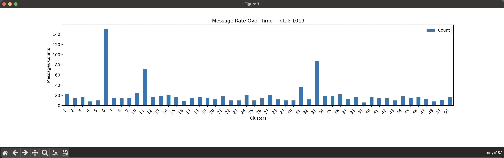
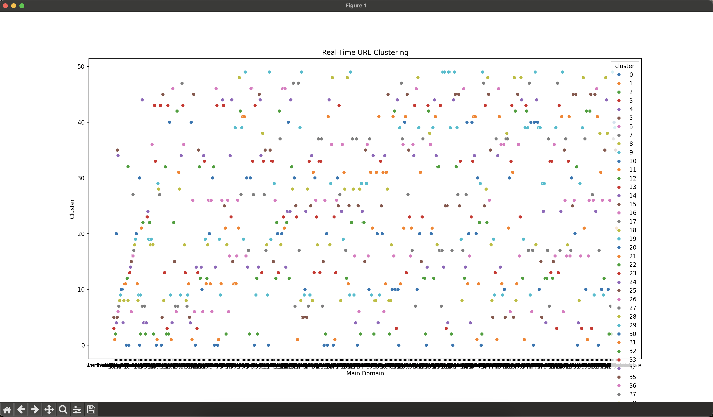

# Kafka and Spark Integration for Real-Time URL Clustering

This project demonstrates the integration of Apache Kafka and Apache Spark for real-time URL clustering. The process involves producing URL data to Kafka topics, consuming the data using Spark, performing K-Means clustering, and visualizing the results.

## Prerequisites

- Java 8 or higher
- Apache Kafka
- Apache Spark
- Python 3.x
- Required Python packages (listed in `requirements.txt`)

## Setup

### Step 1: Download and Install Kafka

1. **Download Kafka**: 
   - Go to the [Kafka Download Page](https://kafka.apache.org/downloads) and download the latest version.

2. **Extract Kafka**:
   ```sh
   tar -xzf kafka_2.13-2.8.0.tgz
   cd kafka_2.13-2.8.0
   ```

### Step 2: Start Zookeeper and Kafka Server

1. **Start Zookeeper**:
    ```sh
   bin/zookeeper-server-start.sh config/zookeeper.properties
    ```
   
2. **Start Kafka Server**:
    ```sh
   bin/kafka-server-start.sh config/server.properties
   ```

### Step 3: Create Kafka Topics

Use the provided script create_topics.py to create Kafka topics. Run the script with:
```sh
python create_topics.py
```

### Step 4: Prepare Data

Ensure you have your data file sample_campaign_data_2023.csv. This file is already preprocessed!
The preprocessing.py file is for larger files (millions of rows)

### Step 5: Create Required Directories

Ensure the directories for Spark output and checkpoints exist:
```sh
mkdir -p tmp/output
mkdir -p tmp/checkpoint
```
### Step 6: Run the Spark Consumer and Clustering

Use the script spark_consumer_producer.py to start the Spark job. Submit the job with:
```sh
spark-submit --packages org.apache.spark:spark-sql-kafka-0-10_2.12:3.5.0 spark_consumer_producer.py
```

### Step 7: Run the Kafka Consumers

Use the script multiple_consumers.py to start the consumers job. Submit the job with:
    
```sh
python multiple_consumers.py
```

### Step 8: Visualize Real-Time URL Clustering

Use the script realtime_visualization_topics.py to see the clustering results in real-time:
```sh
python realtime_visualization_topics.py
```

### Step 9: Visualize Message Counts

Run the visualization script realtime_visualization_messages.py to see the message counts over time for each cluster:
```sh
python realtime_visualization_messages.py
```

### Step 10: Produce Data to Kafka

Use the producer script producer.py to send data to Kafka:
```sh
python producer.py
```

## Requirements
Create a requirements.txt file with the following content:
```sh
confluent_kafka
pandas
matplotlib
seaborn
tldextract
pyspark
```
Install the required Python packages with:
```sh
pip install -r requirements.txt
```

## Project Structure

- create_topics.py: Script to create Kafka topics.
- preprocessing.py: Script to preprocess the input data.
- producer.py: Script to produce data to Kafka topics.
- spark_consumer_producer.py: Script to consume data from Kafka, perform K-Means clustering using Spark, and produce clustered data back to Kafka.
- realtime_visualization_topics.py: Script to visualize the real-time URL clustering.
- realtime_visualization_messages.py: Script to visualize the message counts over time for each cluster.

## Notes

- Ensure Kafka and Zookeeper are running before starting the producer and consumer scripts.
- Adjust the paths in the scripts according to your project directory structure.

# Example of plots from Real-Time run:
## Messages Over Time:


## Clusters Over Time:
